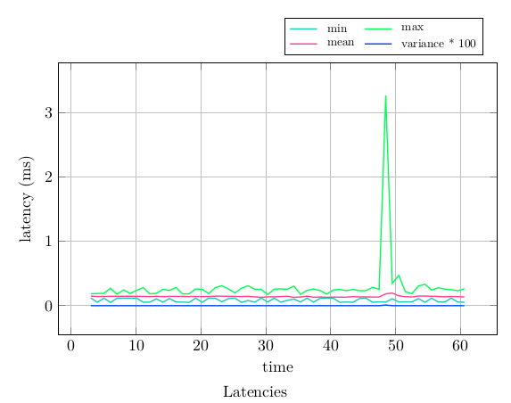
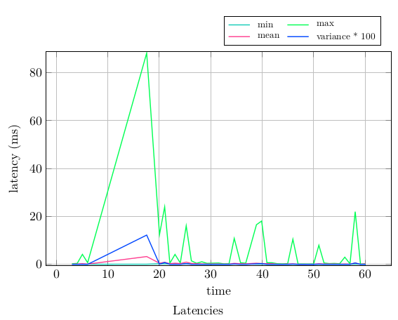
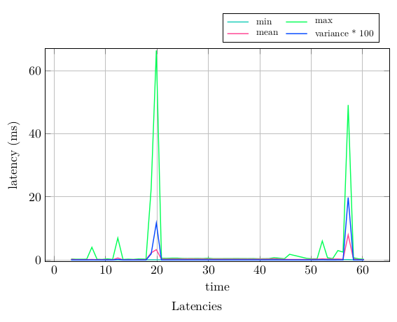
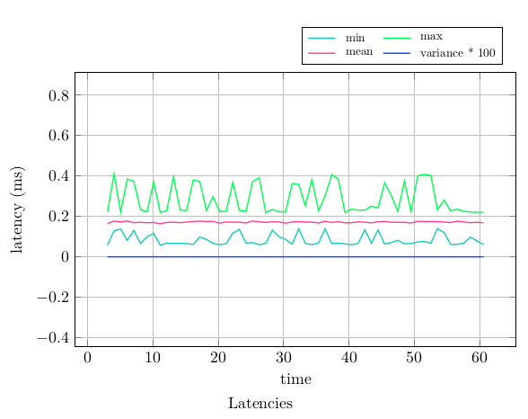
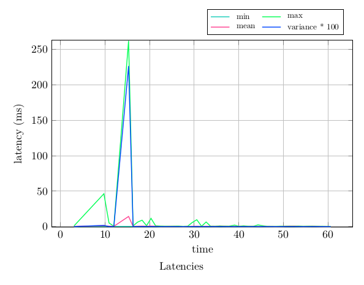
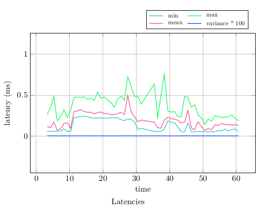

# Running performance_test with real-time settings

## Background

This tutorial will show you how to run the `performance_test` tool with real-time settings and analyze the results. [performance_test](https://gitlab.com/ApexAI/performance_test/) is a tool to test the performance of pub/sub based communication frameworks. This tool support some command line options to configure several settings required to run a process as a real-time application.  These options are implemented in  the`rt_enabler.hpp` file. Here is a short description of the available real-time related command line options:

```bash
   --use_rt_prio <N>
     Set RT priority. Only certain platforms (i.e. Drive PX) have the right
     configuration to support this.

   --use_rt_cpus <N>
     Set RT CPU affinity mask. Only certain platforms (i.e. Drive PX) have
     the right configuration to support this.

These options allow to configure the following real-time settings:
```

- lock memory: locks a pool of memory in the heap into RAM, which prevents page faults due to `malloc` and `free`. This is enabled automatically when one of two available real-time command options is used.
- scheduling and priority: Sets the process threads scheduling policy to `SCHED_FIFO` and  the  priority to a user-defined value. This is configured by using the `--use_rt_prio` option.
- CPU affinity: configures the process to run in a specific CPU core by specifying a CPU mask. This is configured by using the `--use_rt_cpus` option. 

For example, using `--use_rt_prio 80 --use_rt_cpus 3`,  locks the process memory, sets the process scheduling policy to `SCHED_FIFO`, process priority to 80, and will bind the process to CPU cores 1 and 3 ( 3 mask is 101 in binary).

For more information about the real-time settings mentioned above see: 

- [http://design.ros2.org/articles/realtime_background.html](http://design.ros2.org/articles/realtime_background.html)
- [https://wiki.linuxfoundation.org/realtime/documentation/howto/applications/memory](https://wiki.linuxfoundation.org/realtime/documentation/howto/applications/memory)
- [https://wiki.linuxfoundation.org/realtime/documentation/howto/applications/application_base](https://wiki.linuxfoundation.org/realtime/documentation/howto/applications/application_base)

## Build and configure the system

At this time, `performance_test` supports Linux  with the  [PREEMPT_RT patch](https://wiki.linuxfoundation.org/realtime/start) and QNX. For this tutorial we will use a Raspberry Pi 4 Model B Rev 1.2 (4GB) and Linux with the PREEMPT_RT patch. 

Specifically, for this tutorial we will use the following configuration:

- Ubuntu 20.04 with vanilla and real-time kernel
  - vanilla kernel: `Linux ubuntu 5.4.0-1028-raspi `
  - real-time kernel: `Linux ubuntu 5.4.114-rt57`
- ROS 2 Rolling
- Cyclone DDS

See this guide (TODO ADD LINK) to see how to configure the system. If you want to compare the real-time and non-real time kernel you could create two different images or change the kernel in `/boot` and reboot (TODO: add link). It should be possible to run the same experiments in other platforms and with other settings. However, the results may be different than the ones shown in this tutorial.


> **__NOTE__**: You may have to enable swap memory to build `performance_test`


Before running the experiments we will create a directory to store the results and we will source the workspace.

```bash
cd perf_test_ws
mkdir experiment
source install/setup.bash
```

To simplify we will use the same non-real-time settings for all the experiments. 

- Message type: Array1k
- Rate: 100 
- Duration: 600 seconds
- 1 publisher, 1 subscriber
- Communicator: ROS 2 default executor
- Transport: Intra-process (not rclcpp built-in intra-process)

## Run an experiment in a non real-time kernel

First we will run performance test in a non real-time kernel.  

In terminal 1 we run `performance_test`:

```bash
~/perf_test_ws$ ./install/performance_test/lib/performance_test/perf_test -c ROS2 --msg Array1k --rate 100 --max_runtime 60 --ignore 2 --disable_logging  --logfile experiment/log
```

To analyze the results we will use [perfplot](https://gitlab.com/ApexAI/performance_test#plot-results), which is provides with performance_test. We get the following time-series plot:




In this particular case we see one latency spike during the experiment. This spike could be caused by very different reasons: a process is running an preempting the test process, memory paging events, system interrupts, etc. In some experiment we may not see any spikes, this is not something you can easy reproduce cause it depends on the system status. As you see the application will be highly sensitive to what is happening in the system. We can mitigate this by using some of real-time settings described in the previous section. It's hard to which kind of events will affect most your application, it really depends on the applications, system, hardware, etc. For this tutorial we will use the  [stress-ng](https://manpages.ubuntu.com/manpages/artful/man1/stress-ng.1.html) tool to artificially generate different kinds of loads in the system.

Now let's run the same test but stressing the system.  We are going to to use the `--sequential` option to test different kind of loads.

In terminal 1 we run `performance_test`:

```bash
~/perf_test_ws$ ./install/performance_test/lib/performance_test/perf_test -c ROS2 --msg Array1k --rate 100 --max_runtime 60 --ignore 2 --disable_logging  --logfile experiment/log 
```

In terminal 2 we run the stress tool:

```bash
sudo stress-ng --seq 0 -t 1
```

This command will run all the stressors available in `stress-ng` sequentially during 1 second each one. 




We can repeat the experiment using the real-time time `performance_test` settings. We will set the process priority to 80. You can verify that the process priority is successfully set by using [htop](https://man7.org/linux/man-pages/man1/htop.1.html).

In terminal 1:

```bash
~/perf_test_ws$ ./install/performance_test/lib/performance_test/perf_test -c ROS2 --msg Array1k --rate 100 --max_runtime 60 --ignore 2 --logfile experiment/log --use_rt_prio 80
```

In terminal 2:

```bash
sudo stress-ng --seq 0 -t 1
```



As we can see, when we stress the system there are meaningful latency spikes. Using real-time settings may improve the results but it is not enough to achieve a reasonable real-time behavior. This is because we need to run the application in a real-time system.

## Run an experiment in a real-time system

Now, let's repeat the experiment in a real-time system. We start by running a test without using the performance_test real-time settings.

In terminal 1:

```bash
~/perf_test_ws$ ./install/performance_test/lib/performance_test/perf_test -c ROS2 --msg Array1k --rate 100 --max_runtime 60 --ignore 2 --logfile experiment/log
```



By comparing the mean performance of the system idle using a vanilla and a real-time kernel you may notice that the mean latency is usually lower in the vanilla kernel. This is because the real-time kernel is not meant to improve the performance but to achieve bounded latency.

Now, we repeat the test stressing the system. 

In terminal 1:

```bash
~/perf_test_ws$ ./install/performance_test/lib/performance_test/perf_test -c ROS2 --msg Array1k --rate 100 --max_runtime 60 --ignore 2 --logfile experiment/log
```

In terminal 2:

```bash
sudo stress-ng --seq 0 -t 1
```




In the plot above we observe latency spikes again, this is expected cause running an application in a real-time does not guarantee real-time behavior. The application needs to be designed for real-time purposes and real-time settings must be applied.  

Finally, we run the test using the real-time time performance_test settings while we stress the system.

In terminal 1:

```bash
~/perf_test_ws$ ./install/performance_test/lib/performance_test/perf_test -c ROS2 --msg Array1k --rate 100 --max_runtime 60 --ignore 2 --logfile experiment/log --use_rt_prio 30
```

In terminal 2:

```bash
sudo stress-ng --seq 0 -t 1
```




As we observe in the plot above we finally get reasonable bounded latency even if the system is under different load conditions. 